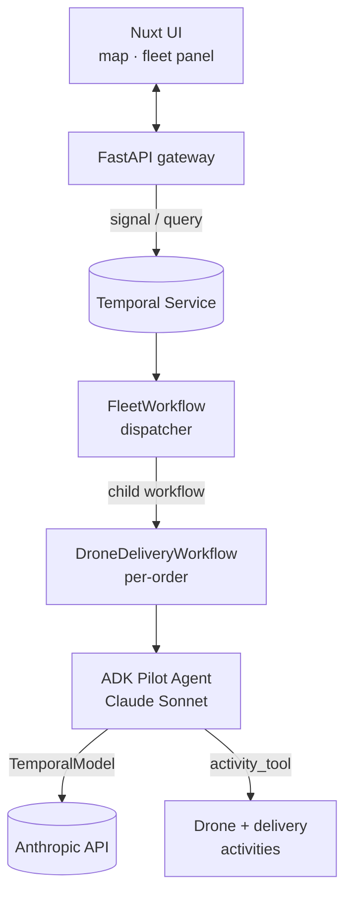

# durable-skies

Durable multi-agent drone delivery demo built on
[Google ADK][adk] and [Temporal][temporal].
A fleet of six autonomous drones executes delivery
missions under the supervision of LLM-powered agents
(Anthropic Claude Sonnet), with every LLM call and
every tool invocation running as a durable Temporal
Activity — crashes, restarts, and deploys never lose
state mid-mission.

[](LICENSE)

## Features

- **Durable agents** — every ADK LLM call and tool
  call is recorded as a Temporal Activity, so agent
  reasoning is replayed deterministically after any
  crash.
- **Durable orchestration** — a fleet-supervisor
  workflow dispatches each incoming order to a
  short-lived per-delivery workflow driven by an
  ADK pilot agent.
- **Claude Sonnet via LiteLLM** — the Google ADK
  talks to Anthropic's Claude models through the
  LiteLLM adapter.
- **Live operations UI** — a Nuxt 4 dashboard
  showing the fleet map and a per-drone status
  panel.
- **One-command local stack** — a Docker Compose
  file brings up a Temporal dev-server container
  (serving both the gRPC frontend and the built-in
  Web UI) alongside a Redis container for live
  drone telemetry; `make` targets start the worker,
  the API, and the frontend.

## Prerequisites

- Python 3.12+
- [uv][uv] for Python dependency management
- Node.js 20+ and [pnpm][pnpm]
- Docker (for the local Temporal server)
- An `ANTHROPIC_API_KEY` for Claude Sonnet

## Getting Started

Clone the repo, set your API key, and start the stack:

```bash
git clone https://github.com/alexandreroman/durable-skies.git
cd durable-skies

cp .env.example .env
# Edit .env and set ANTHROPIC_API_KEY=sk-ant-...

make dev
```

`make dev` brings up Temporal, the worker, the API,
and the Nuxt dev server in one shot. You can also
run `make worker`, `make api`, and `make ui` in
separate terminals if you prefer.

Open `http://localhost:3000` and click
**Submit demo order** to see a drone mission run
end-to-end.

## Usage

Submit an order programmatically:

```bash
curl -X POST http://localhost:8000/orders \
  -H 'Content-Type: application/json' \
  -d '{
    "id": "order-001",
    "pickup_base_id": "base-paris",
    "dropoff_point_id": "dp-1",
    "payload_kg": 1.2,
    "created_at": "2026-04-21T10:00:00Z",
    "status": "pending"
  }'
```

Inspect workflows and activities in the Temporal UI
at `http://localhost:8233` — each agent step shows
up as a workflow or activity you can replay.

## Configuration

Settings are read from environment variables or from
a `.env` file at the project root. All fields have
sensible defaults; only `ANTHROPIC_API_KEY` is
required.

| Variable             | Description                             | Default                       |
| -------------------- | --------------------------------------- | ----------------------------- |
| `ANTHROPIC_API_KEY`  | Anthropic API key (required)            | —                             |
| `TEMPORAL_ADDRESS`   | Temporal frontend host:port             | `localhost:7233`              |
| `TEMPORAL_NAMESPACE` | Temporal namespace                      | `default`                     |
| `REDIS_URL`          | Redis URL for live drone telemetry      | `redis://localhost:6379/0`    |
| `ANTHROPIC_MODEL`    | Claude model (LiteLLM-style identifier) | `anthropic/claude-sonnet-4-6` |
| `API_HOST`           | FastAPI bind address                    | `0.0.0.0`                     |
| `API_PORT`           | FastAPI listen port                     | `8000`                        |

The Nuxt frontend reads `NUXT_PUBLIC_API_BASE` (default
`http://localhost:8000`); set it if you serve the API
on a different host.

## Architecture



| Module     | Description                                                                 |
| ---------- | --------------------------------------------------------------------------- |
| `backend`  | Python package with Temporal workflows, activities, ADK agents, and API.    |
| `frontend` | Nuxt 4 + Vue 3 + Tailwind 4 dashboard for monitoring the fleet.             |

## License

This project is licensed under the Apache-2.0
License — see [LICENSE](LICENSE) for details.

[adk]: https://adk.dev/
[temporal]: https://temporal.io/
[uv]: https://docs.astral.sh/uv/
[pnpm]: https://pnpm.io/
