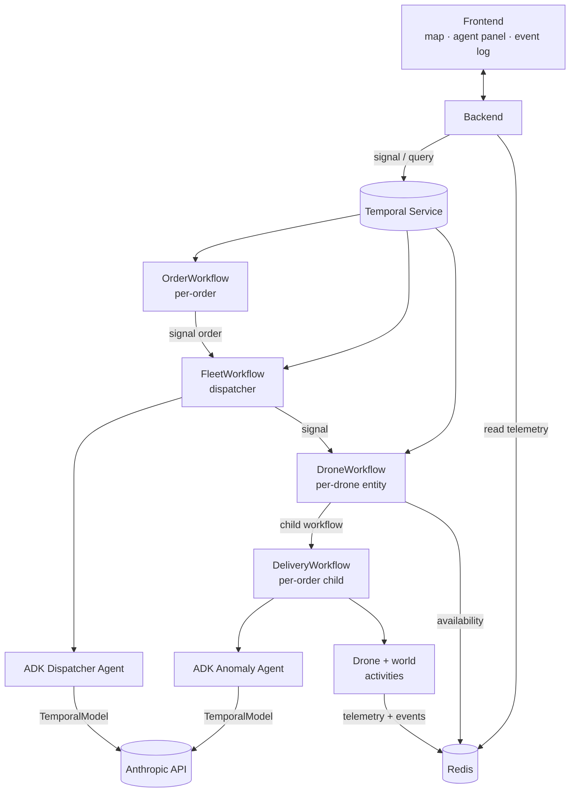

# Durable Skies

[](https://github.com/alexandreroman/durable-skies/actions/workflows/ci.yml)
[](LICENSE)

Durable multi-agent drone delivery demo built on
[Google ADK][adk] and [Temporal][temporal]:
a fleet of four autonomous drones executes delivery
missions under the supervision of LLM-powered agents
(Anthropic Claude), with every LLM call and every
tool invocation running as a durable Temporal
Activity — crashes, restarts, and deploys never lose
state mid-mission.

https://github.com/user-attachments/assets/cbd3f3e9-febf-42f1-ab16-1102ff466446

## Features

- **Durable agents** — every ADK LLM call and tool
  call is recorded as a Temporal Activity, so agent
  reasoning is replayed deterministically after any
  crash.
- **Agents at decision points** — a **dispatcher**
  agent picks the best drone for each incoming
  order, and an **anomaly handler** agent chooses a
  recovery action when an in-flight incident occurs.
  The mission itself is a deterministic activity
  loop.
- **Entity-per-drone orchestration** — a
  `FleetWorkflow` supervisor routes orders to
  long-lived per-drone `DroneWorkflow` entities,
  each spawning a `DeliveryWorkflow` child per
  order. A per-order `OrderWorkflow` makes every
  order individually queryable in the Temporal UI.
- **Claude via LiteLLM** — the Google ADK talks to
  Anthropic's Claude models through the LiteLLM
  adapter: Sonnet for decision-makers, Haiku for
  the dispatcher's analyst sub-agents.
- **Live operations frontend** — a Nuxt 4 dashboard
  with the fleet map, a per-drone agent panel, and a
  streaming event log.
- **One-command local stack** — a Compose file
  brings up a Temporal dev-server container
  (serving both the gRPC frontend and the built-in
  Web UI) alongside a Redis container used for
  live drone telemetry, the fleet event log, and
  the drone availability registry; `make` targets
  start the worker, the API, and the frontend.

## Prerequisites

- Docker (or a Compose-compatible runtime such as
  Podman) for the local stack
- An `ANTHROPIC_API_KEY` for Claude

## Getting Started

Clone the repo, set your API key, and launch the
full stack with Compose:

```bash
git clone https://github.com/alexandreroman/durable-skies.git
cd durable-skies

cp .env.example .env
# Edit .env and set ANTHROPIC_API_KEY=sk-ant-...

make run   # or: docker-compose up
```

This brings up Temporal, Redis, the worker, the API,
and the Nuxt frontend in one shot.

Open `http://localhost:3000` and click
**Submit Orders** to see a drone mission run
end-to-end.

## Usage

Submit an order programmatically. Valid pickup bases
are `base-north`, `base-south`, and `base-east`;
valid delivery points are `dp-1` through `dp-8`:

```bash
curl -X POST http://localhost:8000/orders \
  -H 'Content-Type: application/json' \
  -d '{
    "id": "order-001",
    "pickup_base_id": "base-north",
    "dropoff_point_id": "dp-1",
    "payload_kg": 1.2,
    "created_at": "2026-04-22T10:00:00Z",
    "status": "pending"
  }'
```

Inspect workflows and activities in the Temporal UI
at `http://localhost:8233` — each agent step shows
up as a workflow or activity you can replay.

## Configuration

Settings are read from environment variables or from
a `.env` file at the project root. All fields have
sensible defaults; only `ANTHROPIC_API_KEY` is
required.

| Variable               | Description                                   | Default                       |
| ---------------------- | --------------------------------------------- | ----------------------------- |
| `ANTHROPIC_API_KEY`    | Anthropic API key (required)                  | —                             |
| `TEMPORAL_ADDRESS`     | Temporal frontend host:port                   | `localhost:7233`              |
| `TEMPORAL_NAMESPACE`   | Temporal namespace                            | `default`                     |
| `REDIS_URL`            | Redis URL for telemetry, events, availability | `redis://localhost:6379/0`    |
| `ANTHROPIC_MODEL`      | Claude model for decision-making agents       | `anthropic/claude-sonnet-4-6` |
| `ANTHROPIC_FAST_MODEL` | Claude model for summarizer sub-agents        | `anthropic/claude-haiku-4-5`  |
| `API_HOST`             | FastAPI bind address                          | `0.0.0.0`                     |
| `API_PORT`             | FastAPI listen port                           | `8000`                        |

The Nuxt frontend reads `NUXT_PUBLIC_API_BASE` (default
`http://localhost:8000`); set it if you serve the API
on a different host.

## Development

For iterative work with hot-reload, run the backend
and frontend directly on your host against the
Compose-managed Temporal and Redis:

```bash
make -C backend install   # install Python deps
make infra-up             # start Temporal + Redis only
make dev                  # worker + API + frontend
```

`make dev` runs the worker, the API, and the
frontend with hot-reload in one shot. You can also
run `make worker`, `make api`, and `make ui` in
separate terminals if you prefer.

This flow additionally requires Python 3.12+,
[uv][uv], Node.js 20+, and [pnpm][pnpm] on your
host.

## Architecture



| Module     | Description                                                                                                    |
| ---------- | -------------------------------------------------------------------------------------------------------------- |
| `backend`  | Python package with the FastAPI HTTP API, Temporal workflows, activities, and ADK dispatcher + anomaly agents. |
| `frontend` | Nuxt 4 + Vue 3 + Tailwind 4 dashboard for monitoring the fleet.                                                |

## License

This project is licensed under the Apache-2.0
License — see [LICENSE](LICENSE) for details.

[adk]: https://adk.dev/
[temporal]: https://temporal.io/
[uv]: https://docs.astral.sh/uv/
[pnpm]: https://pnpm.io/
